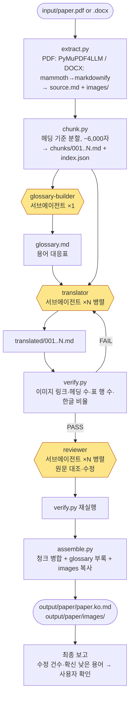
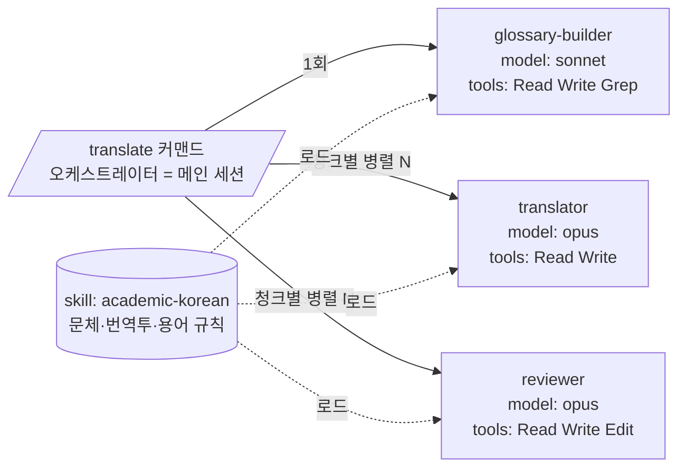

# 논문 한국어 완역 에이전트 — 기획서 (paper-translator)

작성일: 2026-09-02 · 대상 실행환경: Claude Code (로컬) · 작성자: David Lee with Claude

> 이 문서 하나로 Claude Code에서 바로 구축·확장할 수 있게 쓴 기획서다. 함께 제공되는 `paper-translator/` 폴더는 이 기획서의 **1단계(MVP)를 실제로 구현·검증한 결과물**이므로, Claude Code에서 폴더를 열고 `/translate input/paper.pdf`를 치면 바로 동작한다.

---

## 0. 한 줄 요약

영어 논문(PDF·DOCX)을 넣으면 → 그림은 그대로 두고 → 본문·표·캡션을 한국어 학술 서술체로 **완역**한 Markdown을 내놓는 로컬 Claude Code 에이전트. 결정적 작업(추출·분할·병합·검증)은 Python 스크립트가, 판단이 필요한 작업(용어 선정·번역·검수)은 세 종류의 서브에이전트가 맡는다.

## 1. 요구사항 (확정)

| 항목 | 결정 |
|---|---|
| 입력 | PDF, DOCX (둘 다 지원) |
| 출력 | Markdown 1개 + `images/` 폴더 (그림 원본 그대로 링크) |
| 문체 | 학술 논문 완역, 서술체(~다/~이다). 요약·의역 금지 |
| 그림 | 번역하지 않음. 이미지 파일로 추출해 원위치에 ``로 삽입. 캡션만 번역 |
| 실행 | Claude Code 슬래시 커맨드 `/translate`. 별도 API 키·서버 없음 |
| 비목표(MVP) | 수식 OCR, 스캔 PDF OCR, 2단 레이아웃 완벽 복원, DOCX/HWP 출력 |

## 2. 전체 워크플로우 차트



노란 마름모 = LLM 서브에이전트(판단), 사각형 = 결정적 Python 스크립트(재현 가능·토큰 0).
**설계 원칙: 파일을 옮기고 합치는 일은 스크립트만, 문장을 쓰는 일은 에이전트만 한다.** 그림은 어느 단계에서도 손대지 않는다.

## 3. 서브에이전트 구조



| 에이전트 | 역할 | 입력 | 출력 | 왜 분리하나 |
|---|---|---|---|---|
| **glossary-builder** | 논문 전체에서 핵심 용어 20~50개 추출, 역어 확정 | source.md | glossary.md | 청크를 병렬 번역하면 같은 용어가 청크마다 달라진다. 용어표를 먼저 고정해야 일관성이 생김. 저렴한 모델로 충분 |
| **translator** | 청크 1개 완역 | chunks/NNN.md + glossary.md | translated/NNN.md | 컨텍스트를 청크 하나에 집중시켜 누락을 줄이고, N개를 동시에 돌려 시간 단축 |
| **reviewer** | 원문 대조 검수·직접 수정·보고 | chunks/NNN.md + translated/NNN.md | translated/NNN.md(수정), review/NNN.md | 번역한 에이전트는 자기 오류를 못 본다. 별도 컨텍스트의 "두 번째 눈"이 누락·수치·번역투를 잡음 |

파일 위치 (Claude Code 규약):

```
paper-translator/
├── .claude/
│   ├── commands/translate.md          # /translate 오케스트레이션 절차
│   ├── agents/glossary-builder.md     # 서브에이전트 정의 (frontmatter: name/description/tools/model/skills)
│   ├── agents/translator.md
│   ├── agents/reviewer.md
│   └── skills/academic-korean/SKILL.md  # 번역 규칙 (세 에이전트 공유)
├── scripts/extract.py  chunk.py  verify.py  assemble.py  make_sample.py
├── input/   work/<stem>/{source.md,images/,chunks/,translated/,review/,glossary.md}   output/<stem>/
├── requirements.txt  PLAN.md(이 문서)
```

## 4. 도구·스킬·MCP 선정 (조사 결과와 적용 판단)

### 4-1. 문서 추출 (적용함)
| 후보 | 판단 |
|---|---|
| **자체 단 재구성(`columns.py`)** ✅ 채택(2026-09-04) | PyMuPDF 줄 좌표로 단·문단·각주를 직접 판정. Peteraf 실측 보존율 1.006, 잘린 문단 0.026. 혼합 레이아웃(전면 폭 제목 + 2단)에서 가장 안정적 |
| **KorDocAI CLI** ✅ 후보로 유지 | `npx kordoc <pdf> --no-tables`. 순수 2단 페이지는 정확하고 머리글·바닥글을 알아서 지우지만, 혼합 레이아웃 페이지에서 좌우 단을 한 줄에 합친다(Peteraf 잘린 문단 0.145). 문서마다 유불리가 달라 게이트가 점수로 고른다 |
| **PyMuPDF4LLM** ✅ 폴백으로 유지 | ML 모델 없이 CPU만으로 가장 빠름. 2단 조판에서 좌우 단이 섞여 문장이 절단되는 한계 확인. KorDocAI CLI가 없거나(오프라인) 실패할 때만 쓴다 |
| Marker / MinerU / Docling | 레이아웃 인식은 더 좋지만 수 GB 모델·GPU 권장. 2단 레이아웃·스캔 PDF가 많아지면 **2단계에서 Marker로 교체** 검토 |
| **mammoth + markdownify** ✅ 채택 (DOCX) | mammoth가 DOCX의 이미지·헤딩·표를 HTML로 뽑고 markdownify가 표를 Markdown 표로 변환. 순수 Python |

### 4-2. 한국어 글쓰기 스킬 (조사 → 핵심 규칙을 자체 스킬로 내재화)
| 후보 | 내용 | 적용 |
|---|---|---|
| **academic-korean** (자체 제작) ✅ | 학술 서술체 규칙, 번역투 15개 패턴 표, 구조 보존 원칙, 용어 관행, 검수 체크리스트 | MVP에 포함. 외부 스킬은 "일반 문서용"이어서 논문 완역 규칙(문단 1:1, 인용 보존, 참고문헌 미번역 등)이 없음 → 직접 작성이 가장 합리적 |
| [DaleSeo/korean-skills](https://github.com/DaleSeo/korean-skills) `humanizer` | AI 한국어의 40개 패턴(번역투·어색한 띄어쓰기·어휘) 탐지 | **2단계 추가 권장**: `npx skills add daleseo/korean-skills@humanizer` → reviewer 에이전트 `skills:`에 추가 |
| [snflkd/fluent-korean](https://github.com/snflkd/fluent-korean) | 조사 생략·전보문·어색한 은유 방지 output-style | 메인 세션 출력 문체용. 서브에이전트 산출물에는 직접 영향 없음 → 선택 |
| [JangHyun-bin/korean-report-skills](https://github.com/JangHyun-bin/korean-report-skills) `korean-report-style` | 번역투 치환 규칙 115개, 어미 통일 | 규칙 표가 유용. 2단계에서 academic-korean 3절 표를 이 규칙으로 보강 |
| **개조식 보고서 스킬** (사용자 보유) | 개조식 보고서 문체 | 완역에는 사용 금지(명사형 종결은 완역 문체와 충돌). **3단계 "개조식 요약 부록" 옵션**에서 사용 |

### 4-3. MCP
번역 파이프라인 자체는 로컬 파일 입출력만 있어 **MCP가 필요 없다**(추가하면 오히려 의존성만 늘어남). 조사한 학술 MCP([academic-mcp](https://github.com/LinXueyuanStdio/academic-mcp), [academic-search](https://mcpservers.org/servers/afrise/academic-search-mcp-server), [awesome-mcp-korea](https://github.com/darjeeling/awesome-mcp-korea))는 "논문 검색·다운로드" 용도라 **3단계(arXiv/DOI로 바로 받아 번역)** 에서만 의미가 있다. 이미 연결된 PubMed MCP도 같은 위치에서 활용 가능.

## 5. 단계별 계획

### 1단계 — MVP (✅ 완료, 본 폴더)
- [x] extract.py: PDF·DOCX → Markdown + images/ (그림 안 OCR 텍스트 제거, 헤딩 정리)
- [x] chunk.py: 헤딩 기준 분할, 이미지 링크 청크 내 보존, index.json
- [x] academic-korean 스킬, 서브에이전트 3종, `/translate` 커맨드
- [x] verify.py: 이미지 링크 보존·헤딩 수·표 행 수·한글 비율·영문 잔존 검사
- [x] assemble.py: 병합 + 용어표 부록 + images 복사
- [x] **샘플 논문(그림 2·표 1)으로 전 단계 실행 검증**: 추출 → 용어표 38행 → 번역 → verify PASS → 검수 8건 수정(괄호 중첩 병기 등) → verify PASS → output 생성

검증에서 얻은 교훈(이미 반영): 용어표에 `해외이주(유출)`처럼 대안 역어를 넣으면 번역문에 `해외이주(유출)(emigration)` 괄호 중첩이 생김 → 스킬에 "역어는 하나만, 병기는 한 쌍만" 규칙 추가.

### 1단계 재검증 (2026-09-04)

실제 저널 논문(Peteraf 1993, SMJ, JSTOR 2단 스캔본)으로 MVP를 재검증한 결과 **추출 단계가 원문의 3분의 1을 잃고 있었다.** 파이프라인은 "ALL PASS"를 보고했지만 검증이 깨진 원문을 기준으로 삼고 있었다.

| 항목 | 재검증 전 | 재검증 후 |
|---|---|---|
| 문자 보존율 | 0.686 | 1.006 |
| 잘린 문단 비율 | 0.903 | 0.037 |
| 원문 문자 수 | 37,175 | 50,875 |
| JSTOR 푸터·러닝헤드 | 14회 잔존 | 0회 |
| 각주 | 본문에 혼입 | 25개 분리·표시 |
| 이미지 | 경로 어긋나 유실(로고 2장) | 로고·전면스캔 제외, 실제 그림만 |

### 2단계 — 품질·규모 (2026-09-04 일부 완료)

완료된 항목:
- [x] **실제 논문 벤치마크**: Peteraf(SMJ, JSTOR 2단)에서 PyMuPDF4LLM 보존율 0.686 확인 → KorDocAI CLI로 교체(0.972)
- [x] **verify.py 강화**: 이미지 파일 실존·숫자 집합·인용 집합·문단 수 검사 추가
- [x] **컨텍스트 이월**: 청크 경계 문제를 `final-reviewer` 전문 통독 단계로 해결(직전 청크 첨부 방식보다 문서 전체를 본다)
- [x] **손실 게이트**: 추출 품질 미달 시 번역 전 중단(`quality.py`)
- [x] **결과물 판정**: `output-verifier`가 PASS/FAIL을 내리는 최종 관문 추가

남은 항목:
1. ~~**실제 논문 5편 벤치마크**~~ (1편 완료, 나머지 4편은 실사용하며 확인): 2단 레이아웃·긴 표·수식 많은 논문에서 extract 결과를 눈으로 검토. 깨지면 Marker(`pip install marker-pdf`)로 PDF 경로 교체(스크립트 인터페이스는 동일 유지)
2. **humanizer 스킬 추가**: reviewer 에이전트 frontmatter `skills: academic-korean, humanizer`
3. **컨텍스트 이월**: 청크 병렬 번역 시 경계 문장의 지시어("이 결과는…") 어색함 → translator 프롬프트에 직전 청크 마지막 문단을 참고용으로 첨부
4. **비용 최적화**: translator 모델을 sonnet으로 내려 A/B → reviewer(opus)가 품질을 받쳐주는지 확인. 청크 크기 6,000 → 8,000자 실험
5. **verify.py 강화**: 숫자 토큰 집합 비교(원문의 모든 수치가 번역에 존재하는지), 인용 `(Author, YYYY)` 집합 비교
6. **글로서리 사용자 확인 게이트**: `/translate --confirm-glossary` 옵션 → 용어표를 보여주고 승인 후 번역 진행

### 3단계 — 확장
1. **개조식 요약 부록**: `/translate --summary` → 완역 후 개조식 보고서 스킬로 □○-· 요약 1~2쪽 추가 (내부 회람용)
2. **대조본 출력**: 문단 단위 영/한 나란히 보기 HTML (`assemble.py --bilingual`)
3. **DOCX/HWP 변환**: pandoc으로 `.ko.md` → `.docx` (HWP는 docx 경유), 그림 임베드
4. **입력 확장**: arXiv ID / DOI 입력 → academic-mcp 또는 PubMed MCP로 PDF 획득 → 파이프라인 진입
5. **배치 모드**: `input/` 폴더 전체 순회, 실패 논문 재시도 큐
6. **번역 메모리**: 논문 간 glossary 누적(`glossary_global.md`) → 같은 분야 논문 용어 일관성

## 6. 사용법 (Claude Code)

```bash
cd paper-translator
pip install -r requirements.txt
# (샘플 재생성이 필요하면) python scripts/make_sample.py   ← LibreOffice 필요, 없으면 sample.pdf 그대로 사용
claude                      # Claude Code 시작
> /translate input/sample.pdf
```
결과: `output/sample/sample.ko.md`, `output/sample/images/`. 검수 보고: `work/sample/review/*.md`.

수동 단계 실행(디버깅용):
```bash
python scripts/extract.py input/paper.pdf && python scripts/chunk.py work/paper
# → 에이전트 실행(Claude Code) →
python scripts/verify.py work/paper && python scripts/assemble.py work/paper
```

## 7. 리스크와 대응

| 리스크 | 대응 |
|---|---|
| PDF 2단 레이아웃에서 문단 순서 섞임 | 1차: PyMuPDF4LLM 결과 검토 / 2차: Marker 교체 (2단계-1) |
| 긴 논문(30쪽+) → 청크 10~15개, 토큰 비용 | 병렬 배치 5개 단위, translator sonnet A/B (2단계-4) |
| 번역 누락 | 문단 1:1 규칙 + reviewer 문장 대조 + verify 한글비율·영문잔존 검사 (3중) |
| 용어 불일치 | glossary 선행 생성 + reviewer 통일 + 부록 표로 사용자 확인 |
| 그림 캡션이 그림 안에 박힌 경우 | 캡션은 이미지로 남음(번역 불가) → 3단계에서 캡션 OCR 후 아래에 번역 캡션 추가 검토 |
| 참고문헌을 번역해버림 | 스킬·에이전트 프롬프트에 명시 + verify는 References 섹션 한글비율 검사 제외 |

## 8. 참고 자료
- PDF→Markdown 도구 비교: [themenonlab 2026 비교](https://themenonlab.blog/blog/best-open-source-pdf-to-markdown-tools-2026), [PyMuPDF4LLM vs Docling](https://www.file2markdown.ai/blog/pymupdf4llm-vs-docling)
- 한국어 스킬: [DaleSeo/korean-skills](https://github.com/DaleSeo/korean-skills), [snflkd/fluent-korean](https://github.com/snflkd/fluent-korean), [JangHyun-bin/korean-report-skills](https://github.com/JangHyun-bin/korean-report-skills), [awesome-korean-agent-skills](https://github.com/J-nowcow/awesome-korean-agent-skills)
- 학술 MCP: [academic-mcp](https://github.com/LinXueyuanStdio/academic-mcp), [awesome-mcp-korea](https://github.com/darjeeling/awesome-mcp-korea)
